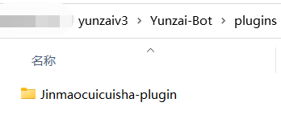

<div align="center">
  <br>
    

  
<h1>Jinmaocuicuisha-plugin</h1>


# [ 点击访问脆脆鲨网页 ](https://ccsxy.netlify.app) 使用nelify部署
脆脆鲨插件是一个Yunzai-Bot的扩展插件，给bot提供一些便携管理和一些娱乐功能


</div>
<div align="center">

[](https://gitee.com/JMCCS/Jinmaocuicuisha/blob/master/Plugin%20version.md)
[](https://gitee.com/JMCCS)
[](https://gitee.com/SHIKEAIXY)
[](https://gitee.com/Le-niao/Yunzai-Bot)
<a href='https://gitee.com/JMCCS/Jinmaocuicuisha/stargazers'></img></a>
<a href='https://gitee.com/JMCCS/Jinmaocuicuisha/members'></img></a>

[](https://gitee.com/JMCCS/Jinmaocuicuisha.git)

</div>


## 介绍

1.基于 [Yunzai-Bot V3](https://gitee.com/Le-niao/Yunzai-Bot) 的功能插件

2.脆脆鲨插件仅支持v3云崽，v2云崽请勿下载

3.脆脆鲨插件适配[时雨](https://gitee.com/TimeRainStarSky)的[TRSS-Yunzai](https://gitee.com/TimeRainStarSky/Yunzai)

4.关于 [TRSS-Yunzai](https://gitee.com/TimeRainStarSky/Yunzai) 的协议端：[go-cqhttp](https://github.com/Mrs4s/go-cqhttp) 以及 [icqq](https://github.com/icqqjs/icqq) 可无限制使用该插件，其他协议端将会被大大的限制使用

5.关于 [Miao-Yunzai](https://gitee.com/yoimiya-kokomi/Miao-Yunzai) 的微信适配器：[WeChat-plugin](https://gitee.com/Zyy955/WeChat-plugin) 也将会被大大的限制使用

6.关于以上说的原因是脆脆鲨插件主要是对QQBot的管理，虽已适配但大部分功能还是限制于QQ

7.QAQ抄的各位大佬的，感觉没啥用的样子

8.在这里说一下在[`apps/UP.js`](https://gitee.com/JMCCS/Jinmaocuicuisha/blob/master/apps/UP.js)中写了2个作者的[`更新权限`](https://gitee.com/JMCCS/Jinmaocuicuisha/blob/master/resources/%E8%82%BE%E8%99%9A%E7%9A%84%E8%84%86%E8%84%86%E9%B2%A8/up%E6%9D%83%E9%99%90.png)可以自行删除

9.注意！注意！注意！安装本插件后请第一时间给机器人发 `#设置绝对权限`

  如果佬们 有什么问题请务必pr
<br>
    

---

## 安装教程

注意:一定要CD至云崽根目录再输入下面的内容

请前往锅巴配置部分内容

### gitee下载（强烈推荐）
```
git clone --depth 1 https://gitee.com/JMCCS/Jinmaocuicuisha-plugin.git ./plugins/Jinmaocuicuisha-plugin
```
### github下载
```
git clone --depth 1 https://github.com/SHIKEAIXY/Jinmaocuicuisha.git ./plugins/Jinmaocuicuisha-plugin
```
### zip下载

[点击此处下载](https://gitee.com/JMCCS/Jinmaocuicuisha/repository/archive/master.zip)

下好后重命名为`Jinmaocuicuisha-plugin`放进plugins文件中
<br>
    

#### zip下载请在云崽根目录使用下方命令

```
cd plugins/Jinmaocuicuisha-plugin
```
```
git init
```
```
git remote add origin https://gitee.com/JMCCS/Jinmaocuicuisha.git
```

---

## 功能介绍&报错解决

> Jinmaocuicuisha-plugin提供以下功能
> 详细内容请使用 **脆脆鲨帮助（第一次使用需先 #设置绝对权限 ）**  查看

| `功能介绍/报错解决`|
| ------------- |
|[点击此处查看脆脆鲨使用帮助](https://gitee.com/JMCCS/Jinmaocuicuisha/blob/master/Plugin%20function.md)|

---
 
## 宣一下群
欢迎各位大佬萌新进群玩：`脆脆鲨群:` [657142904](https://jq.qq.com/?_wv=1027&k=PrOc8Qp4)

---

| `关于版本`|
| ------------- |
|[点击查看脆脆鲨版本](https://gitee.com/JMCCS/Jinmaocuicuisha/blob/master/Plugin%20version.md)|

---

## 免责声明

1. 功能仅限内部交流与小范围使用，请勿将 `Yunzai-Bot` 及 `Jinmaocuicuisha-plugin` 用于任何以盈利为目的的场景；
2. 素材均来自于网络，仅供交流学习使用，如有侵权请联系，会立即删除。
